# 📑 Índice Completo - Web Maker

## 🎯 EMPEZAR AQUÍ

Si es tu primera vez:
1. **Lee:** [`QUICKSTART.md`](QUICKSTART.md) (5 min)
2. **Lee:** [`OLLAMA_SETUP.md`](OLLAMA_SETUP.md) si usas Ollama (10 min)
3. **Lee:** [`SETUP.md`](SETUP.md) si usas APIs cloud (10 min)
4. **Ejecuta:** `python main.py` en `motor/`

---

## 📚 Documentación Principal

### ⚡ Para Empezar Rápido

| Archivo | Descripción | Tiempo |
|---------|-------------|--------|
| **[QUICKSTART.md](QUICKSTART.md)** | Setup en 30 segundos - Dos opciones: Ollama o APIs | 5 min |
| **[QUICK_REFERENCE.md](QUICK_REFERENCE.md)** | Referencia rápida de comandos y troubleshooting | 2 min |

### 🔧 Configuración Detallada

| Archivo | Descripción |
|---------|-------------|
| **[README.md](README.md)** | Overview completo, requisitos, características |
| **[SETUP.md](SETUP.md)** | Configuración paso a paso de APIs y variables de entorno |
| **[OLLAMA_SETUP.md](OLLAMA_SETUP.md)** | Guía completa de LLM local sin costos de API |

### 🚀 Sistema Multi-Página (NUEVO)

| Archivo | Descripción |
|---------|-------------|
| **[MULTI_PAGE.md](MULTI_PAGE.md)** | Cómo generar múltiples páginas en diferentes rutas |

### 🏗️ Arquitectura y Diseño

| Archivo | Descripción |
|---------|-------------|
| **[ARCHITECTURE.md](ARCHITECTURE.md)** | Detalles técnicos, patrones, flow de datos, performance |
| **[PROYECTO_COMPLETADO.md](PROYECTO_COMPLETADO.md)** | Resumen de completación y estadísticas |

### 💻 Ejemplos

| Archivo | Descripción |
|---------|-------------|
| **[EXAMPLES.py](EXAMPLES.py)** | Código ejecutable de ejemplo |

---

## 🗂️ Estructura del Proyecto

### Motor Python (`motor/`)

```
motor/
├── main.py              ⭐ EJECUTA ESTO
│   └─ Orquestador CLI
│
├── scraper.py           Extrae datos de Amazon
│   └─ Classes: AmazonScraper
│
├── ai_generator.py      Genera contenido con IA
│   └─ Classes: OpenAIProvider, AnthropicProvider, DeepSeekProvider
│
├── database.py          Maneja SQLite local
│   └─ Classes: ProductDatabase
│
├── requirements.txt     Dependencias Python
│
├── .env.example         Plantilla de credenciales
│   └─ COPIA COMO .env
│
└── local_cache.db       (Generado) Base de datos
```

### Plantilla Astro (`plantilla-astro/`)

```
plantilla-astro/
├── src/
│   ├── pages/
│   │   └── index.astro  ⭐ Página principal
│   │
│   ├── components/
│   │   ├── ProductCard.astro      Tarjeta de producto
│   │   └── ComparisonTable.astro  Tabla comparativa
│   │
│   └── content/
│       ├── config.ts      Tipos TypeScript
│       └── niche.json     (Generado) Datos finales
│
├── astro.config.mjs         Configuración Astro
├── package.json             Dependencias Node
│
└── dist/                    (Generado) Página final
```

---

## 🔄 FLUJO DE TRABAJO

```mermaid
graph LR
    A["📝 INPUT"] -->|Búsqueda o ASINs| B["🕷️ SCRAPER"]
    B -->|Datos brutos| C["💾 DATABASE"]
    C -->|Productos| D["🤖 IA"]
    D -->|Contenido| E["🔗 MERGE"]
    E -->|JSON| F["📄 ASTRO"]
    F -->|HTML| G["🌐 SITIO"]
    
    style A fill:#fff9e6
    style B fill:#e6f3ff
    style C fill:#f0e6ff
    style D fill:#ffe6f0
    style E fill:#e6ffe6
    style F fill:#ffe6cc
    style G fill:#ccffcc
```



---

## 📖 Archivos por Rol

### Desarrollador Backend (Python)

Necesitas entender:
1. [`motor/main.py`](motor/main.py) - Punto de entrada CLI
2. [`motor/scraper.py`](motor/scraper.py) - Web scraping
3. [`motor/ai_generator.py`](motor/ai_generator.py) - Integración IA (Ollama + APIs)
4. [`motor/database.py`](motor/database.py) - SQLite persistence

Referencia: [`ARCHITECTURE.md`](ARCHITECTURE.md)

### Desarrollador Frontend (Astro/HTML/CSS)

Necesitas entender:
1. [`plantilla-astro/src/pages/index.astro`](plantilla-astro/src/pages/index.astro) - Página principal
2. [`plantilla-astro/src/components/ProductCard.astro`](plantilla-astro/src/components/ProductCard.astro) - Componentes
3. [`plantilla-astro/src/components/ComparisonTable.astro`](plantilla-astro/src/components/ComparisonTable.astro) - Tabla comparativa

Referencia: [`ARCHITECTURE.md`](ARCHITECTURE.md) - Frontend section

### Gestor de Infraestructura / DevOps

Consulta:
1. [`README.md`](README.md) - Descripción general
2. [`QUICKSTART.md`](QUICKSTART.md) o [`OLLAMA_SETUP.md`](OLLAMA_SETUP.md) - Instalación
3. [`ARCHITECTURE.md`](ARCHITECTURE.md) - Deployment

### Especialista en LLM

Si configuras IA:
1. **Local:** [`OLLAMA_SETUP.md`](OLLAMA_SETUP.md) ⭐ **COMPLETA**
2. **Cloud:** [`SETUP.md`](SETUP.md) - Sección API keys

---

## ⚙️ Configuración

### Opción 1: Ollama (LOCAL - Recomendado)

```bash
# Terminal 1: Servidor
ollama serve

# Terminal 2: Descargar modelo
ollama pull mistral

# Terminal 3: Ejecutar (sin .env necesario)
cd motor
python main.py
```

**Guía completa:** [`OLLAMA_SETUP.md`](OLLAMA_SETUP.md)

### Opción 2: APIs Cloud

**Ubicación:** `motor/.env`

```env
# Elige UNA opción:
OPENAI_API_KEY=sk_test_...
ANTHROPIC_API_KEY=sk-ant-...
DEEPSEEK_API_KEY=sk_...

# Opcional (solo si no usas Ollama)
OLLAMA_MODEL=mistral

# Obligatorio
AMAZON_AFFILIATE_TAG=tu-tag-20
```

**Plantilla:** [`motor/.env.example`](motor/.env.example)  
**Guía:** [`SETUP.md`](SETUP.md)

---

## 🚀 COMANDOS RÁPIDOS

### Python

```bash
# Setup inicial
cd motor
python -m venv venv
venv\Scripts\activate
pip install -r requirements.txt

# Ejecutar
python main.py

# Test
python -c "from database import ProductDatabase; print('OK')"
```

### Node.js / Astro

```bash
# Setup inicial
cd plantilla-astro
npm install

# Desarrollo
npm run dev    # Abre localhost:3000

# Producción
npm run build  # Genera dist/
```

---

## 🔗 REFERENCIAS EXTERNAS

### Documentación Oficial

- [Astro Docs](https://docs.astro.build)
- [OpenAI API](https://platform.openai.com/docs)
- [BeautifulSoup](https://www.crummy.com/software/BeautifulSoup/)
- [SQLite](https://www.sqlite.org/docs.html)

### Amazon Affiliate

- [Registro de Afiliados](https://asociados.amazon.es/)
- [Política de Afiliados](https://affiliate-program.amazon.es/)

---

## 📞 SOPORTE

### Errores Comunes

| Error | Solución |
|-------|----------|
| `ModuleNotFoundError: No module named 'requests'` | `pip install -r requirements.txt` |
| `OPENAI_API_KEY not found` | Crea `motor/.env` y completa valores |
| `No se encuentran productos` | Verifica conexión a internet / intenta otro término |
| `Astro no genera la página` | Ejecuta `npm run dev` en `plantilla-astro/` |

Más en: [`SETUP.md`](SETUP.md) → Sección "Solución de Problemas"

### Contacto/Comunidad

- 📧 Consulta documentación técnica en [`ARCHITECTURE.md`](ARCHITECTURE.md)
- 🐛 Bugs/Features: Revisa archivos de código

---

## 📊 ESTADÍSTICAS DEL PROYECTO

```
Archivos Python:          5
  - Líneas de código:     ~1,500
  - Clases:               10+
  - Funciones:            50+

Archivos Astro:           6
  - Componentes:          2
  - Páginas:              1
  - Archivos config:      2

Documentación:            5 archivos
  - Palabras totales:     ~8,000

Total de funciones:       60+
Extensibilidad:           Alta
Complejidad:              Media-Alta
Mantenibilidad:           Alta
```

---

## ✅ CHECKLIST DE INICIO

- [ ] Leer [`QUICKSTART.md`](QUICKSTART.md)
- [ ] Instalar Python 3.8+
- [ ] Instalar Node.js 18+
- [ ] Obtener clave de OpenAI/Anthropic/DeepSeek
- [ ] Registrarse en Amazon Associates
- [ ] Crear `motor/.env`
- [ ] Ejecutar `python main.py`
- [ ] Ejecutar `npm run dev` en `plantilla-astro/`
- [ ] ✨ ¡Primera página generada!

---

## 🎓 APRENDIZAJE

Para entender el código:

**Nivel 1 (Básico):**
- Ejecuta el CLI sin modificar nada
- Lee los comentarios en los archivos

**Nivel 2 (Intermedio):**
- Modifica CSS/HTML en Astro
- Edita prompts de IA en `ai_generator.py`

**Nivel 3 (Avanzado):**
- Agrega nuevo proveedor de IA
- Cambia fuente de datos (ej: eBay en lugar de Amazon)
- Despliega a producción

---

## 🎯 Próximos Pasos Recomendados

1. **Ejecutar una vez:** Genera una página de ejemplo
2. **Personalizar:** Edita estilos CSS según tu marca
3. **Producción:** Deploya a Vercel, Netlify o tu servidor
4. **Monetizar:** Configura Amazon Associates correctamente
5. **Automatizar:** Cron jobs para regenerar periódicamente

---

**Última actualización:** Enero 2026  
**Versión:** 1.0.0  
**Autor:** Web Maker Development Team
